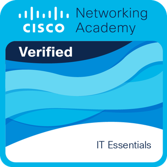

<div align="center">

# 👋 ¡Hola! Soy Patryck Yandell Jiménez Ogando

### 💻 Software Developer | Full-Stack Developer | 🚀 Tecnología & Innovación

<p>
  <a href="mailto:patryckyandelljimenez@gmail.com">
    
  </a>
  <a href="https://www.linkedin.com/in/patryck-jim%C3%A9nez">
    
  </a>
  <a href="https://github.com/jpatryck04">
    
  </a>
</p>

<p>
  
</p>

</div>

---

## 👨‍💻 Sobre mí

Soy **Software Developer** enfocado en el desarrollo de aplicaciones web, móviles y soluciones empresariales.

Soy **egresado del Instituto Tecnológico de Las Américas (ITLA)** como **Tecnólogo en Desarrollo de Software** y actualmente curso la **Ingeniería de Software en la Universidad del Caribe (UNICARIBE)**.

He trabajado con tecnologías como **TypeScript, JavaScript, Angular, React, Next.js, Vue, C#, .NET, Node.js, APIs REST y bases de datos relacionales**, además de soluciones empresariales utilizando **Microsoft Power Platform, SharePoint y Power Automate**.

Me interesa construir software **escalable, mantenible y orientado a resolver problemas reales**, aplicando buenas prácticas de desarrollo, automatización de procesos, integración de APIs, diseño de bases de datos y metodologías modernas.

Actualmente continúo fortaleciendo mis conocimientos en **arquitectura de software, desarrollo Full-Stack, ecosistema .NET, DevOps, testing y automatización**.

---

## 💼 Experiencia & Proyectos Profesionales

### 🏥 Sistema de Gestión de Viáticos — MISPAS

Sistema desarrollado para el **Ministerio de Salud Pública y Asistencia Social (MISPAS)**.

**Participación en:**

* Desarrollo de aplicaciones web orientadas a procesos institucionales.
* Desarrollo de interfaces utilizando **Angular y TypeScript**.
* Integración con **APIs REST**.
* Trabajo con bases de datos relacionales.
* Implementación de funcionalidades orientadas a procesos empresariales.
* Organización y mantenimiento del código siguiendo buenas prácticas de desarrollo.

**Stack:**

`Angular` `TypeScript` `REST API` `SQL` `Git`

---

### 🏢 Soluciones Empresariales — Microsoft Power Platform

Desarrollo de soluciones empresariales utilizando el ecosistema de **Microsoft Power Platform**.

Entre las soluciones trabajadas:

* Sistemas de gestión de inspecciones.
* Control y administración de tickets de combustible.
* Automatización de procesos mediante **Power Automate**.
* Integración con **SharePoint**.
* Registro de firmas digitales.
* Gestión de estados y movimientos.
* Automatización de notificaciones mediante Outlook.
* Administración de información institucional.

**Stack:**

`Power Apps` `Power Automate` `SharePoint` `Microsoft 365` `Outlook`

---

## 🛠️ Tech Stack

### 🌐 Frontend

<p>
  
</p>

`HTML5` · `CSS3` · `JavaScript` · `TypeScript` · `Angular` · `React` · `Next.js` · `Vue.js` · `Tailwind CSS`

---

### ⚙️ Backend

<p>
  
</p>

`C#` · `.NET` · `Node.js` · `Java` · `Python` · `REST APIs`

---

### 📱 Mobile Development

<p>
  
</p>

`Ionic` · `Capacitor` · `Vue.js` · `Android`

---

### 🗄️ Databases

<p>
  
</p>

`MySQL` · `PostgreSQL` · `Oracle` · `MongoDB` · `Supabase`

---

### ☁️ Microsoft & Business Solutions

<p>
  
  
  
  
</p>

`Power Apps` · `Power Automate` · `SharePoint` · `Microsoft 365` · `Outlook`

---

### 🧰 DevOps & Tools

<p>
  
</p>

`Git` · `GitHub` · `GitLab` · `Docker` · `GitHub Actions` · `VS Code` · `Visual Studio`

---

## 🏗️ Engineering Practices

Me interesa desarrollar software siguiendo principios y prácticas que permitan mantener los proyectos de forma eficiente a largo plazo.

* 🧱 Clean Code
* SOLID
* DRY
* KISS
* 🔌 RESTful APIs
* 🧩 Component-Based Architecture
* 🗄️ Database Design
* 🔄 CI/CD
* 🧪 Software Testing
* 🔐 Secure Development
* 📦 Modular Architecture
* 📈 Scalability
* 🔧 Maintainability

---

# 🚀 Proyectos Destacados

| Proyecto                              | Descripción                                                                     | Tecnologías                                                 |                              Repositorio                              |
| :------------------------------------ | :------------------------------------------------------------------------------ | :---------------------------------------------------------- | :-------------------------------------------------------------------: |
| **🏥 Sistema de Gestión de Viáticos** | Sistema web desarrollado para procesos institucionales del MISPAS.              | `Angular` `TypeScript` `REST API`                           |                                   —                                   |
| **🌱 EcoVigía RD**                    | Aplicación móvil orientada a la gestión y seguimiento de información ambiental. | `Vue 3` `TypeScript` `Capacitor` `Android`                  |       [Ver proyecto](https://github.com/jpatryck04/EcoVigia-rd)       |
| **📒 Electronic Agenda**              | Aplicación de escritorio para gestión de contactos.                             | `C#` `.NET` `Windows Forms`                                 |    [Ver proyecto](https://github.com/jpatryck04/AgendaElectronica)    |
| **🔄 Web Calculator CI/CD**           | Calculadora web con pruebas automatizadas y flujo CI/CD.                        | `HTML` `CSS` `JavaScript` `Node.js` `Jest` `GitHub Actions` |     [Ver proyecto](https://github.com/jpatryck04/aplicacion-ci-cd)    |
| **🤖 User Classification**            | Clasificación y segmentación de usuarios mediante Machine Learning.             | `Python` `Machine Learning`                                 | [Ver proyecto](https://github.com/jpatryck04/Inteligencia_Artificial) |
| **📱 Ionic + Vue App**                | Aplicación móvil interactiva desarrollada con Ionic y Vue.                      | `Ionic 7` `Vue 3` `JavaScript`                              |     [Ver proyecto](https://github.com/jpatryck04/App_Movile_Ionic)    |

---

## 🎓 Formación

### 🏛️ Instituto Tecnológico de Las Américas — ITLA

**Tecnólogo en Desarrollo de Software**

🎓 **Egresado**

Formación técnica enfocada en desarrollo de software, programación, bases de datos, desarrollo web y fundamentos de ingeniería de software.

---

### 🎓 Universidad del Caribe — UNICARIBE

**Ingeniería de Software**

📚 **Actualmente cursando**

Formación universitaria orientada al diseño, desarrollo, gestión y mantenimiento de soluciones de software, complementando mi formación técnica con conocimientos de ingeniería y arquitectura de software.

---

## 🏆 Certificaciones

| Certificación                                          | Institución              |   Fecha  |
| :----------------------------------------------------- | :----------------------- | :------: |
| **ISTQB Certified Tester Foundation Level (CTFL 4.0)** | Udemy                    | Abr 2025 |
| **Professional Scrum Master I (PSM I)**                | Scrum.org                |     —    |
| **IT Essentials**                                      | Cisco Networking Academy | Abr 2024 |
| **JavaScript Essentials 1**                            | Cisco Networking Academy | Nov 2025 |
| **AWS Digital Learning Badge**                         | AWS                      |     —    |

### 🎖️ Credenciales

<p align="center">

<a href="https://www.credly.com/badges/42dca66c-72af-4fea-abd9-2b4d4d617531/public_url">
  
</a>

   

<a href="https://www.credly.com/badges/a6901e3c-9821-47bc-bc0b-9cfaa65d5ebb/public_url">
  
</a>

   

<a href="./certificados/(CTFL).png">
  
</a>

   

<a href="./certificados/(PSM1).png">
  
</a>

   

<a href="./certificados/(JSE1).png">
  
</a>

</p>

---

## 📚 Cursos

| Curso                                                 | Institución |   Fecha  |
| :---------------------------------------------------- | :---------- | :------: |
| **Python for Beginners — Learn to Code from Scratch** | Udemy       | Mar 2025 |
| **Introduction to C# Programming from Scratch**       | Udemy       | Mar 2025 |
| **Get Started with Jira**                             | Coursera    | Nov 2025 |

---

## 🎯 Actualmente

```text
🔭 Desarrollando aplicaciones web y soluciones empresariales
🌱 Profundizando en .NET y arquitectura de software
⚙️ Explorando DevOps, CI/CD y automatización
🧪 Fortaleciendo conocimientos en testing y QA
☁️ Trabajando con Microsoft Power Platform
📱 Desarrollando soluciones web y móviles
🚀 Aprendiendo continuamente nuevas tecnologías
```

---

## 📈 GitHub Statistics

<p align="center">
  
  
</p>

<p align="center">
  
</p>

---

## 📊 GitHub Activity

<p align="center">
  
</p>

---

## 🌎 Idiomas

* 🇪🇸 **Español** — Nativo
* 🇺🇸 **Inglés** — En desarrollo

---

## 📫 Contacto

<p align="center">

<a href="mailto:patryckyandelljimenez@gmail.com">
  
</a>

<a href="https://www.linkedin.com/in/patryck-jim%C3%A9nez">
  
</a>

<a href="https://github.com/jpatryck04">
  
</a>

</p>

---

<div align="center">

### 💡 "Construir software no es solamente escribir código; es convertir problemas en soluciones."

⭐ Si alguno de mis proyectos te resulta interesante, no dudes en explorarlo.

</div>
