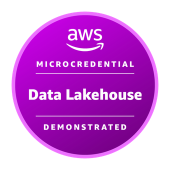
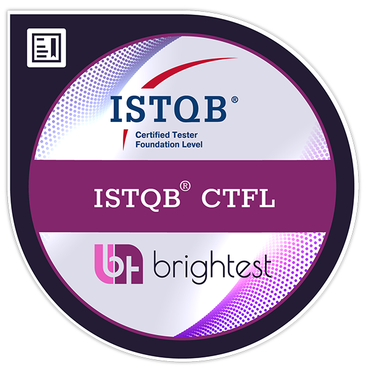
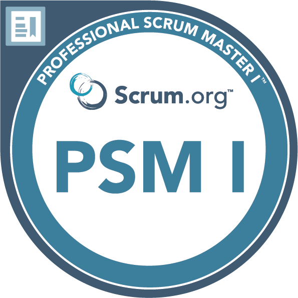
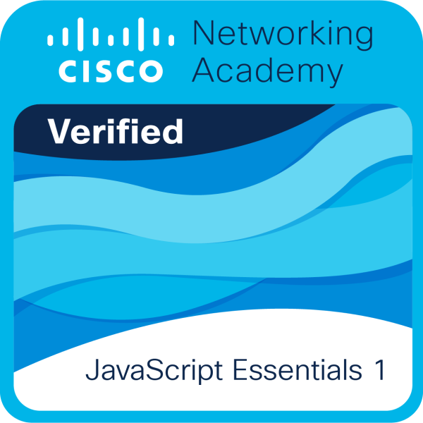

# 👋 Hello! I'm Patryck Yandell Jiménez Ogando

### 💻 Software Developer | Full-Stack & Business Solutions

  
  &nbsp;
  
  &nbsp;
  

💡 *"Building software isn't just writing code; it's converting problems into solutions."*

 

> 🔐 **About Me:** Software Developer focused on web development, mobile apps, and enterprise solutions. Graduate of **ITLA** with a degree in Software Development and currently pursuing a Software Engineering degree at **UNICARIBE**. Passionate about building scalable, maintainable software designed to solve real-world problems.

---

## 🛠️ Tech Stack

| Category | Technologies |
| :--- | :--- |
| **Frontend & Mobile** |  |
| **Backend & Databases** |  |
| **DevOps & Cloud** |  |

---

## 💼 Experience & Professional Projects

<strong>🏥 Travel Allowance Management System — MISPAS</strong>

 

*Web-based system developed for institutional processes at the Ministry of Public Health and Social Assistance (MISPAS).*
* **Development:** Process-oriented web applications featuring interfaces built with **Angular** and **TypeScript**.
* **Integration:** Integration and consumption of **REST APIs** along with relational databases.
* **Stack:** `Angular` `TypeScript` `REST API` `SQL` `Git`

 

<strong>🏢 Enterprise Solutions — Microsoft Power Platform</strong>

 

*Development of enterprise solutions using the Microsoft Power Platform ecosystem.*
* **Systems & Inspections:** Inspection management, fuel ticket administration, and automated notifications.
* **Automation & Logging:** Workflow automation using **Power Automate**, digital signatures, and integration with **SharePoint** and **Outlook**.
* **Stack:** `Power Apps` `Power Automate` `SharePoint` `Microsoft 365` `Outlook`

---

## 📌 Highlighted Projects

| Project | Description | Technologies | Repository |
| :--- | :--- | :--- | :---: |
| **EcoVigía RD** | Mobile application for managing and monitoring environmental information | `Vue 3` `TypeScript` `Capacitor` `Android` | [View Project](https://github.com/jpatryck04/EcoVigia-rd.git) |
| **Electronic Agenda** | Desktop application for contact management | `C#` `.NET` `Windows Forms` | [View Project](https://github.com/jpatryck04/AgendaElectronica.git) |
| **Web Calculator CI/CD** | Web calculator with automated testing and CI/CD workflow | `HTML` `CSS` `JS` `Node.js` `Jest` `Actions` | [View Project](https://github.com/jpatryck04/aplicacion-ci-cd.git) |
| **User Classification** | User classification and segmentation using Machine Learning | `Python` `Machine Learning` | [View Project](https://github.com/jpatryck04/Inteligencia_Artificial.git) |
| **Ionic + Vue App** | Interactive mobile application featuring various tools | `Ionic 7` `Vue 3` `JavaScript` | [View Project](https://github.com/jpatryck04/App_Movile_Ionic.git) |

---

## 🧱 Engineering Practices

  <code>Clean Code</code> &nbsp;•&nbsp; <code>SOLID</code> &nbsp;•&nbsp; <code>DRY</code> &nbsp;•&nbsp; <code>KISS</code> &nbsp;•&nbsp; <code>RESTful APIs</code> &nbsp;•&nbsp; <code>Component-Based Architecture</code> 
  <code>Database Design</code> &nbsp;•&nbsp; <code>CI/CD</code> &nbsp;•&nbsp; <code>Software Testing</code> &nbsp;•&nbsp; <code>Secure Development</code> &nbsp;•&nbsp; <code>Modular Architecture</code>

---

## 🎓 Education

| Institution | Degree / Program | Status |
| :--- | :--- | :---: |
| **Instituto Tecnológico de Las Américas (ITLA)** | Technologist in Software Development | `🎓 Graduated` |
| **Universidad del Caribe (UNICARIBE)** | Software Engineering | `📚 In Progress` |

---

## 🏅 Certifications & Courses

| Certification / Course | Institution | Date | Credential |
| :--- | :--- | :---: | :---: |
| **ISTQB Certified Tester Foundation Level (CTFL 4.0)** | `Udemy` | Apr 2025 | [📄 View](./certificados/ISTQB%20Certified%20Tester%20Foundation%20Level%20(CTFL%204.0).pdf) |
| **JavaScript Essentials 1** | `Cisco Networking Academy` | Nov 2025 | [📄 View](./certificados/JavaScriptEssentials.pdf) |
| **IT Essentials** | `Cisco Networking Academy` | Apr 2024 | [📄 View](./certificados/ITEssentialsUpdate20250313-28-oua1fi.pdf) |
| **Get Started with Jira** | `Coursera` | Nov 2025 | [📄 View](./certificados/certificado%20Jira.pdf) |
| **Python for Beginners - Learn to Code from Scratch** | `Udemy` | Mar 2025 | [📄 View](./certificados/Certificado%20Udemy%20-%20Python.pdf) |
| **Introduction to C# Programming from Scratch** | `Udemy` | Mar 2025 | [📄 View](./certificados/Certificado%20Udemy%20-%20C%23.pdf) |

 

  &nbsp;&nbsp;&nbsp;&nbsp;&nbsp;&nbsp;&nbsp;&nbsp;&nbsp;&nbsp;&nbsp;&nbsp;

---

## 🎯 Current Focus

* 🔭 Developing web applications and enterprise solutions.
* 🌱 Deepening knowledge in **.NET** and software architecture.
* ⚙️ Exploring **DevOps**, **CI/CD**, and process automation.
* 🧪 Strengthening skills in testing, **QA**, and continuous integration.

---

## 📈 GitHub Statistics

  

  
  

  

---

  🌎 <strong>Languages:</strong> 🇪🇸 Spanish (Native) &nbsp;•&nbsp; 🇺🇸 English (Developing)

